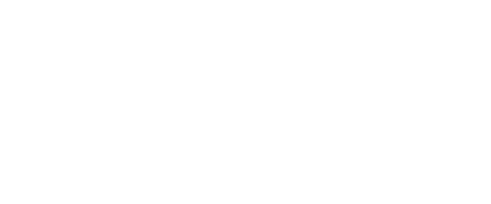

<p align="center">
  <a href="https://charla.pro/?utm_source=github&utm_medium=logo" target="_blank">
    
  </a>
</p>

# Charla SDK for PHP

[](https://github.com/CharlaAI/charla-php/actions?query=workflow%3ACI+branch%3Amain)
[](https://packagist.org/packages/charla/charla-php-sdk)
[](https://packagist.org/packages/charla/charla-php-sdk)
[](https://packagist.org/packages/charla/charla-php-sdk) 
[](https://packagist.org/packages/charla/charla-php-sdk)

The Sentry PHP error reporter tracks errors and exceptions that happen during the
execution of your application and provides instant notification with detailed
information needed to prioritize, identify, reproduce and fix each issue.

## Getting started

### Install

Install the SDK using [Composer](https://getcomposer.org/).

```bash
composer require charla/charla-php-sdk
```

## Usage

#### Initialize client
```php
$factory = new \CharlaAI\Charla\Transport\HttpTransportFactory();
$transport = $factory->create(new \CharlaAI\Charla\Options('TOKEN', 'https://charla.pro'))

$client = new \CharlaAI\Charla\Http\Client($transport);
```

#### Transcribe audio
```php
use CharlaAI\Charla\Http\Methods\Business\v1\Chat;

$client = new \CharlaAI\Charla\Http\Client($transport);

$audio = fopen('audio.mp3', 'r');

$client->call(Chat::class)->transcribe($audio, $add_language, $diarize, $with_timestamp, $format);
```

#### List history
```php
use CharlaAI\Charla\Http\Methods\Business\v1\Chat;

$client = new \CharlaAI\Charla\Http\Client($transport);

$client->call(Chat::class)->list($page, $per_page, $from, $to);
```

#### Get history
```php
use CharlaAI\Charla\Http\Methods\Business\v1\Chat;

$client = new \CharlaAI\Charla\Http\Client($transport);

$client->call(Chat::class)->get($id);
```

## Contributing to the SDK

Please refer to [CONTRIBUTING.md](CONTRIBUTING.md).

## Security

If you discover any security related issues, please email [support@charla.pro](mailto:support@charla.pro) instead of using the issue tracker.

## Getting help/support

If you need help setting up or configuring the PHP SDK please head over to the [support@charla.pro](mailto:support@charla.pro).

## License

Licensed under the MIT license, see [`LICENSE`](LICENSE)
